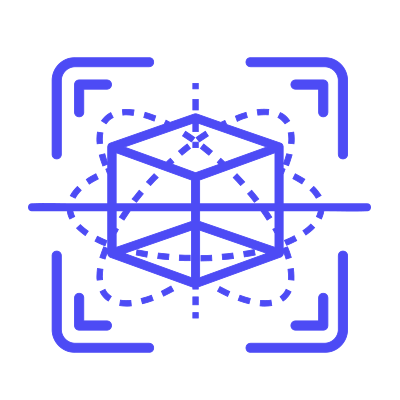
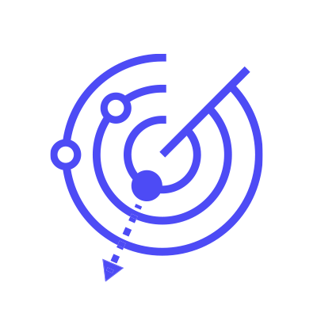
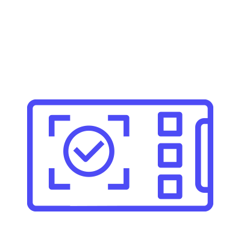
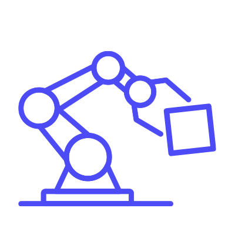

# Benchmark Specification

- [Benchmark Specification](#benchmark-specification)
  - [Motivation](#motivation)
    - [Why ROS 2 for performance benchmarking in robotics?](#why-ros-2-for-performance-benchmarking-in-robotics)
    - [Standard-driven benchmarking](#standard-driven-benchmarking)
  - [General concepts](#general-concepts)
    - [Nomenclature](#nomenclature)
    - [IDs](#ids)
    - [Metrics](#metrics)
    - [ROS 2-native](#ros-2-native)
    - [Category](#category)
    - [Computing Targets](#computing-targets)
  - [Creating a new benchmark](#creating-a-new-benchmark)

This document describes **how each RobotPerf benchmark should be designed and implemented**. The benchmarks are designed to be <ins>representative of the performance of a robotic system and should be easily reproducible</ins> across compute targets. The benchmarks are designed to be <ins>technology agnostic</ins> and <ins>vendor-neutral</ins> so that they can be used to evaluate robotics computing performance across compute substratrated including CPUs, GPUs, FPGAs and other compute accelerators. The benchmarks are designed to be <ins>open and fair</ins> so that robotic architects can make informed decisions about the hardware and software components of their robotic systems. For all these reasons, we build on top of ROS 2, the de facto standard for robot application development.

## Motivation

### Why ROS 2 for performance benchmarking in robotics?

Robot behaviors take the form of computational graphs, with data flowing between computation Nodes, across physical networks (communication buses) and while mapping to underlying sensors and actuators. The popular choice to build these computational graphs for robots these days is the Robot Operating System (ROS)[^1], a framework for robot application development. ROS enables you to build computational graphs and create robot behaviors by providing libraries, a communication infrastructure, drivers and tools to put it all together. Most companies building real robots today use ROS or similar event-driven software frameworks. ROS is thereby the common language in robotics, with several [hundreds of companies](https://github.com/vmayoral/ros-robotics-companies) and thousands of developers using it everyday. ROS 2 [^2] was redesigned from the ground up to address some of the challenges in ROS and solves many of the problems in building reliable robotics systems.

### Standard-driven benchmarking

RobotPerf benchmarks aligns (*and will contribute*) to robotics standards so that you don’t spend time reinventing the wheel and re-develop what already works for most. Particularly benchmarks are conducted using the Robot Operating System 2 ([ROS 2](https://accelerationrobotics.com/ros.php)) as its common baseline. RobotPerf also aligns to standardization initiatives within the ROS ecosystem related to computing performance and benchmarking such as [REP 2008](https://github.com/ros-infrastructure/rep/pull/324) (ROS 2 Hardware Acceleration Architecture and Conventions) and the [REP 2014](https://github.com/ros-infrastructure/rep/pull/364) (Benchmarking performance in ROS 2).

## General concepts

### Nomenclature
This specification

### IDs
Each benchmark should have an associated ID that is unique across all benchmarks. The ID should be a string and correspond with the preffix of the associated ROS 2 package name to that benchmark (*e.g. ID: `a1`, package name: `a1_perception_2node`*). The ID should be used to identify the benchmark in the RobotPerf suite.

### Metrics
Benchmarks should be designed to measure one or more metrics and according to [REP 2014](https://github.com/ros-infrastructure/rep/pull/364). Each metric should be associated with a unit of measurement as defined below. The metrics should be defined in the benchmark's `README.md` file.

### ROS 2-native 
Each benchmark should be a ROS 2 package and should build and run using the common ROS 2 development flows (build tools, meta-build tools, etc.).

### Category
Each benchmark should be categorized as one of the following:

| `a` Perception | `b` Localization | `c` Control | `d` Navigation | `e` Manipulation |
|:---:|:---:|:---:|:---:|:---:|
|  |  |  |  |  | 

### Computing Targets

Each computing target will be marked with a symbol denoting its group as in:
  - edge/embedded -> 🤖
  - workstation -> 🖥️
  - data center -> 🗄
  - cloud targets -> ⛅

This way, targets can be grouped and compared easily.

## Creating a new benchmark
WIP